<div align="center">


# 📱 Docify: Photo, PDF & CV Maker

### *Resize photo, signature, PDF and CV for online applications — all on your phone.*


<a href="LICENSE"></a>

<br/>

**🌐 [Web Preview](https://keshab1997.github.io/docify/preview/main/)** ·
**🔒 [Privacy Policy](https://keshab1997.github.io/docify/privacy.html)** ·
**📜 [Terms of Service](https://keshab1997.github.io/docify/terms.html)** ·
**✉️ [Support](mailto:keshabsarkar2018@gmail.com)**

</div>

---

## 🌟 About Docify

**Docify** helps you prepare photos, signatures, PDFs and a simple CV for **job applications, exam forms and college admissions** — all on your phone, **private by design**.

> Resize a photo to the exact KB limit. Make a passport-size photo. Clean a signature. Turn images into a PDF. Merge files. Compress PDF. Build a CV. Keep everything on your phone.

---

## 🛠️ What You Can Do

<table>
  <tr>
    <td width="50%" align="center" valign="top">

### 📸 Photo Tools

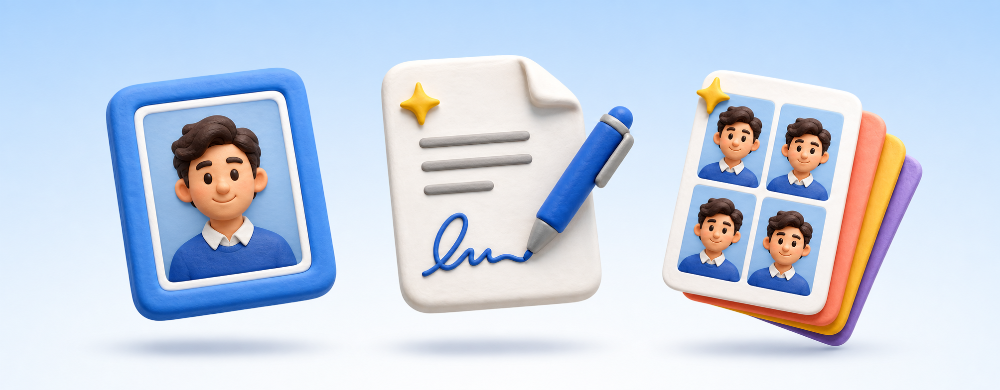

- **Photo resize** — set min–max KB, custom pixels, crop & compress
- **Exam presets** — SSC, IBPS, RRB, UPSC, PSC & more
- **Passport size photo** — 35×45 mm / 2×2 inch, white / blue / red backgrounds, multiple copies in one sheet
- **Signature resize** — draw or pick photo, clean background, resize to required KB
- **Crop image** — free, square, 4:3, 16:9, passport ratios
- **JPG ↔ PNG** — instant conversion

</td>
    <td width="50%" align="center" valign="top">

### 📄 PDF Tools

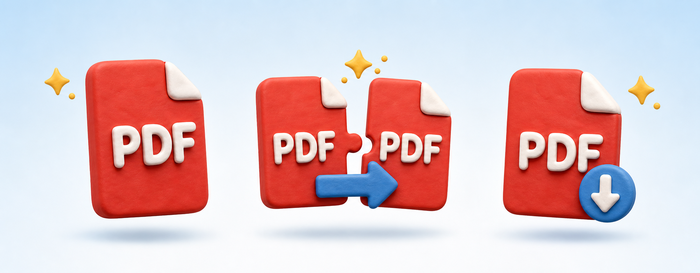

- **Image → PDF** — multiple images into one PDF
- **Merge PDF** — combine multiple PDFs
- **Compress PDF** — reduce size for upload limits
- **PDF → Images** — extract pages as JPG
- **Document scan** — camera capture + auto crop, right on your phone

</td>
  </tr>
  <tr>
    <td align="center" valign="top">

### 🎓 CV & Documents

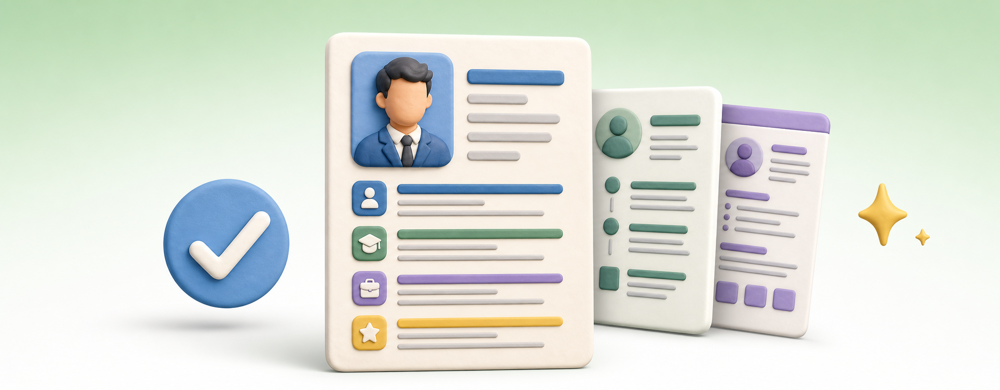

- **CV builder** — 10 professional templates, simple local PDF, no account, **no watermark**
- **Job Form Assistant** — checklist for one application

</td>
    <td align="center" valign="top">

### 📁 My Documents


- All files saved in-app, share via WhatsApp, Email, Drive or any app
- **Fingerprint lock** — protect My Documents with biometrics
- Smart folders: Job Forms, ID Proof, Certificates, Photo & Signature

</td>
  </tr>
</table>

---

## 💼 Built for Online Forms


Many portals **reject a photo or signature** because size, pixels or format do not match. Docify is a **preparation tool**:

- ✅ Shows you the **exact KB, pixels and format before you save**
- ✅ Exam presets for India: **SSC CGL/CHSL, IBPS PO/Clerk, RRB, UPSC, WBCS** and more
- ✅ Fast, offline, lightweight
- ℹ️ It does **not** submit forms for you — and it is **not** an official app of any exam board or government

---

## 📱 See It in Action

### Phone (portrait)

<div align="center">

| Home | Tools | Documents | Profile |
|:---:|:---:|:---:|:---:|
| 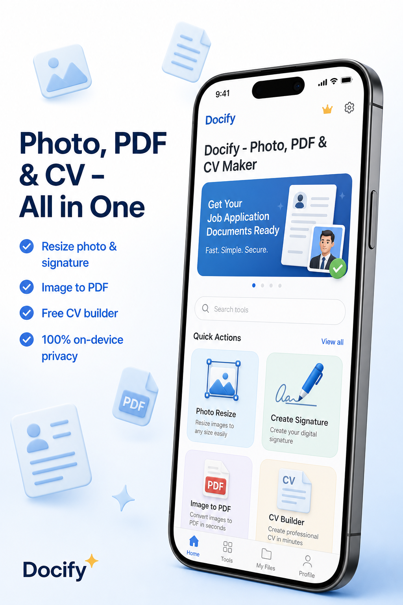 | 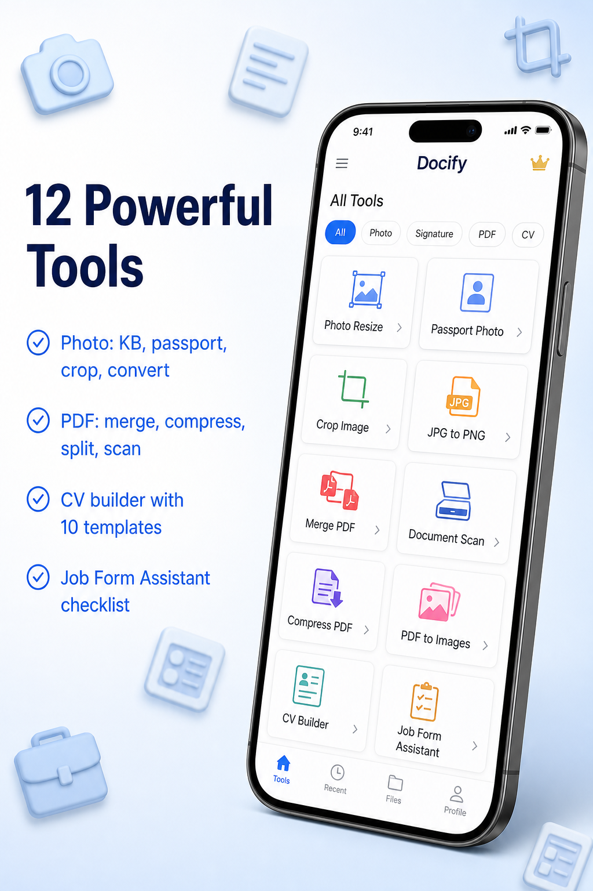 | 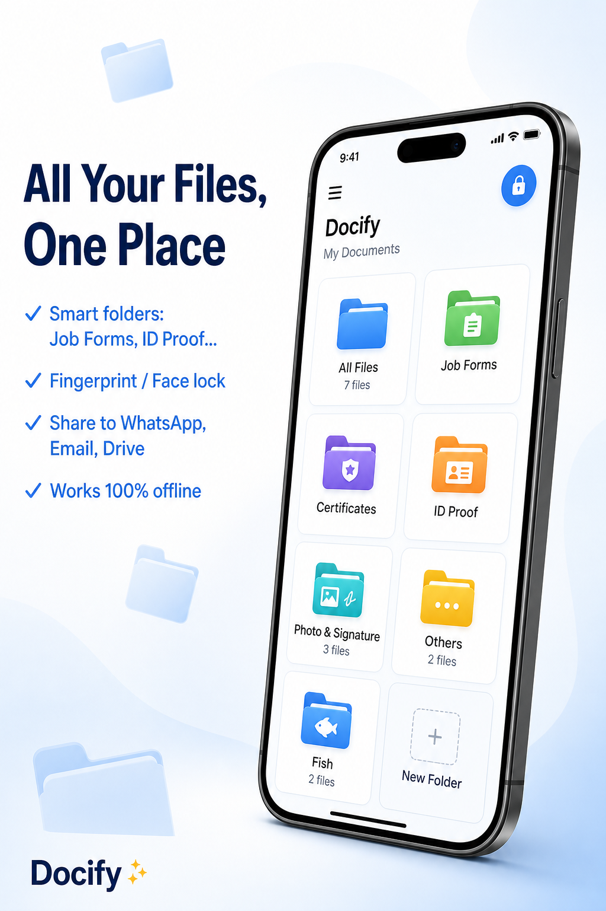 | 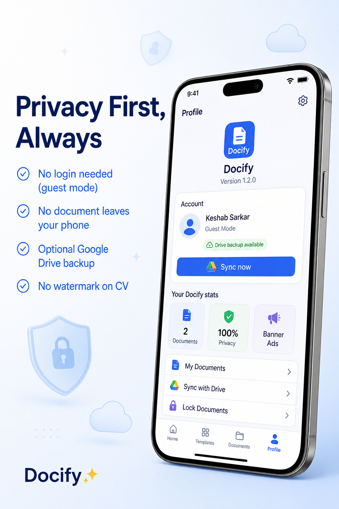 |

</div>

### 7-inch tablet (landscape)

<div align="center">

| Home | Tools | Documents | Profile |
|:---:|:---:|:---:|:---:|
| 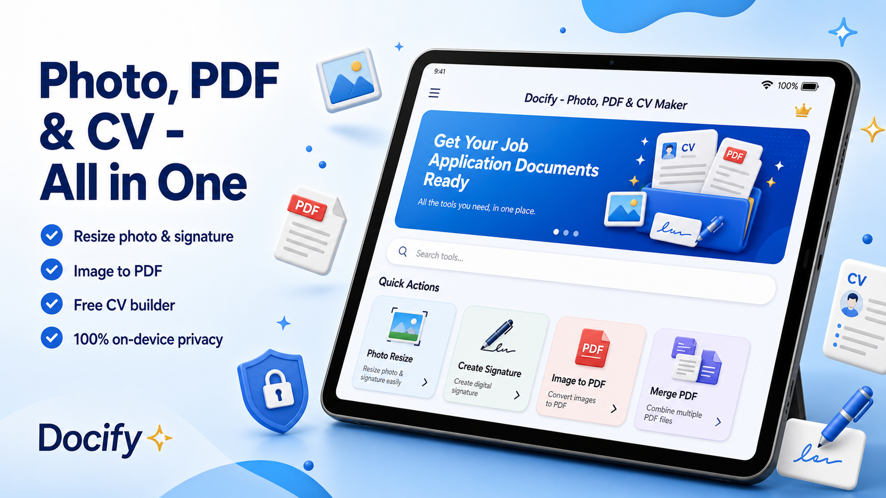 | 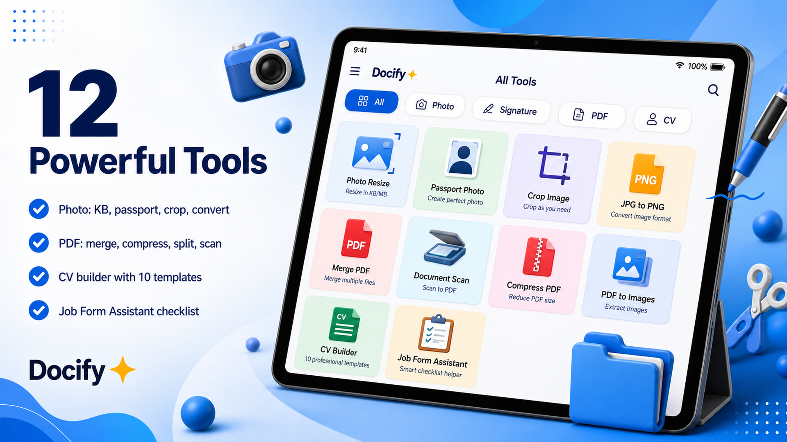 | 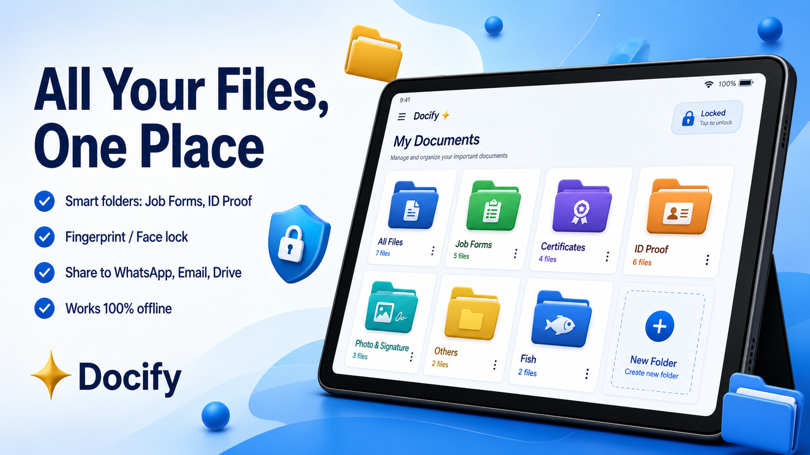 | 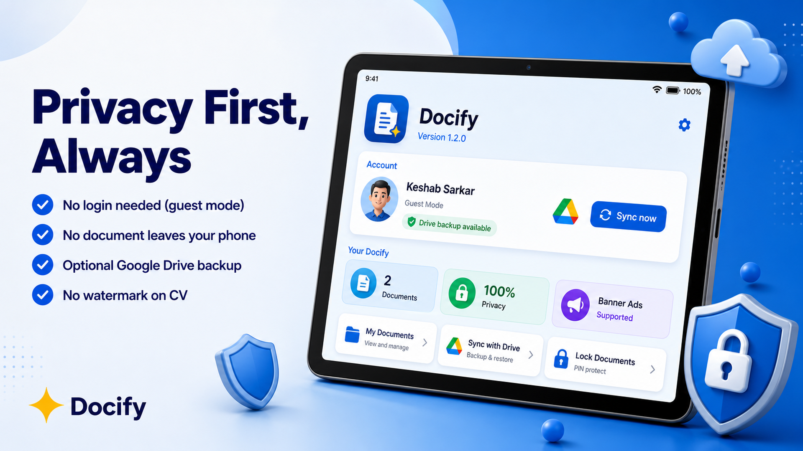 |

</div>

---

## 🔒 Private by Design


| | |
|---|---|
| 📱 **On-device processing** | Photos, signatures, PDFs and CV text are processed **on your device** |
| 🚫 **No server upload** | Docify does **NOT** upload your documents to a server — we do not operate one |
| ☁️ **Optional backup** | Sign in with Google → files go to a *Docify* folder in **YOUR Google Drive** — your account, your storage. **Off by default** |
| 🔐 **Biometric lock** | My Documents can be locked with fingerprint / face / PIN — Android checks it, we never see your biometrics |
| 📵 **Minimal permissions** | No broad storage, no location, no contacts, no SMS. Camera only when you tap *Scan* / *Capture signature* |
| 📢 **Ads** | The app shows ads via Google AdMob — see the [privacy policy](https://keshab1997.github.io/docify/privacy.html) for ad SDK details |

---

## ❓ Why Docify?

- 🔓 **No login required** — works fully as guest
- 🧼 **No watermark on CV** (since v1.1.2)
- 🇮🇳 **Exam presets for India** — SSC, IBPS, RRB, UPSC, WBCS & more
- ⚡ **Fast, offline, lightweight**
- 🇮🇳 **Made in India with care**

---

## 🧰 Tech Stack

<div align="center">


</div>

- **Framework:** Flutter ≥ 3.22 (Dart ≥ 3.2)
- **State:** Riverpod · **UI:** Google Fonts, Material
- **PDF & print:** `pdf` + `printing` · **Images:** `image`, `crop_your_image`
- **Security:** `local_auth` (biometric lock) · **Storage:** on-device only
- **Optional sync:** Firebase Auth + Google Sign-In → user's own Drive

---

## 🏗️ Architecture

Docify is a **single Flutter codebase** (Android + Web) built in clean layers — UI never touches storage or platform APIs directly, and everything is **offline-first**.

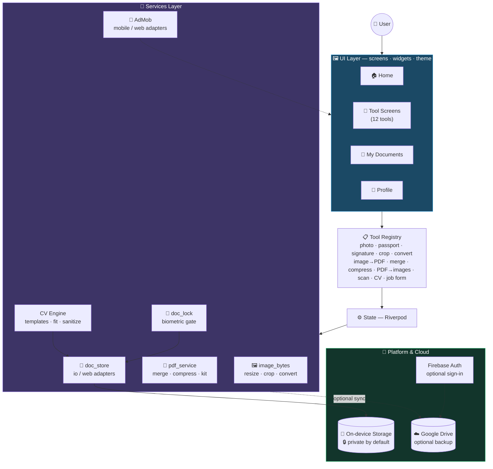

### 📂 Project Structure

```
lib/
├── main.dart                  # App entry point
├── app_info.dart              # App name, package & metadata
├── tools/
│   └── tool_registry.dart     # 📋 All 12 tools registered in one place
├── screens/                   # 🖼️ UI screens
│   ├── home_screen.dart       #   Dashboard — all tools
│   ├── tools/                 #   12 tool screens (resize, passport, PDF, CV…)
│   ├── documents_screen.dart  #   My Documents — folders, share, lock
│   └── profile_screen.dart    #   Profile, sync & legal
├── widgets/                   # 🧩 Reusable widgets (ad banner, lock gate, sync sheet…)
├── models/                    # 📦 Exam presets, saved docs, CV templates
├── services/                  # 🔧 Core logic (no UI here)
│   ├── image_bytes.dart       #   Image processing (resize, crop, convert)
│   ├── pdf_service.dart       #   PDF create / compress
│   ├── pdf_merge.dart         #   Merge & split
│   ├── cv/                    #   CV templates + PDF kit + text sanitizer
│   ├── drive/                 #   Optional Google Drive sync
│   ├── doc_store*.dart        #   Storage — io / web adapters
│   ├── doc_lock.dart          #   Biometric lock (local_auth)
│   └── ads*.dart              #   AdMob — mobile / web adapters
└── theme/                     # 🎨 App theming

assets/
├── readme/                    # 🛠️ README hero & section visuals (this README uses them)
└── playstore/                 # 🏪 Google Play Store listing assets
```

### 🧭 Key Architecture Decisions

| Decision | Why |
|---|---|
| **Offline-first** | All processing happens on-device — works without internet, and documents never leave the phone |
| **Platform adapters** (`*_io.dart` / `*_web.dart`) | One codebase runs on **Android + Web** via conditional imports |
| **Tool Registry** | Adding a new tool = one screen + one registry entry — tools stay independent |
| **Riverpod state** | Predictable, testable state with clear UI / logic boundaries |
| **Optional cloud** | Google Drive backup & sign-in are opt-in — the app is fully usable as a guest |

---

## 🚀 Getting Started

```bash
# 1. Clone the repo
git clone https://github.com/Keshab1997/docify.git
cd docify

# 2. Install dependencies
flutter pub get

# 3. Run on your device / emulator
flutter run

# 4. Build a release APK
flutter build apk --release
```

---

## 📜 License

**This project is not open source.** The source code is published here for **viewing and educational reference only**.

**Copyright © 2026 Keshab Sarkar — All Rights Reserved.**

Without prior written permission from the copyright holder, you may **NOT**:

- 🚫 copy, modify, or redistribute this software
- 🚫 publish it (or any derivative) to **any app store** — including Google Play Store
- 🚫 sell, sublicense, or commercially exploit it

> ✅ You **may** freely view and study the code for learning purposes.

See the full terms here → [**LICENSE**](LICENSE) · Permission requests: 📧 [keshabsarkar2018@gmail.com](mailto:keshabsarkar2018@gmail.com)

---

## 📬 Support & Links

<div align="center">

**Questions or feedback?** 📧 [keshabsarkar2018@gmail.com](mailto:keshabsarkar2018@gmail.com)

**🌐 [Web Preview](https://keshab1997.github.io/docify/preview/main/)** ·
**🔒 [Privacy Policy](https://keshab1997.github.io/docify/privacy.html)** ·
**📜 [Terms](https://keshab1997.github.io/docify/terms.html)**

</div>

> **Disclaimer:** Docify is a preparation tool, not an official app of SSC, IBPS, RRB, UPSC, or any government body. Please check your form's official notification for exact photo/signature requirements.
>
> **Audience:** Docify is for adults (18+) preparing job, exam and college forms. It is not directed to children under 13.

---

<div align="center">


<sub>✨ Docify — Prepare right. Apply with confidence. 🇮🇳</sub>

</div>